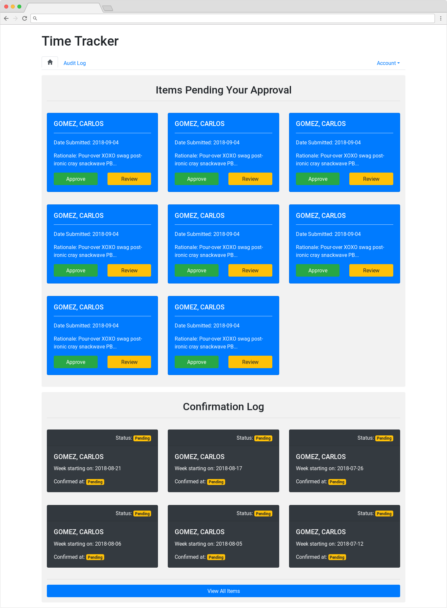
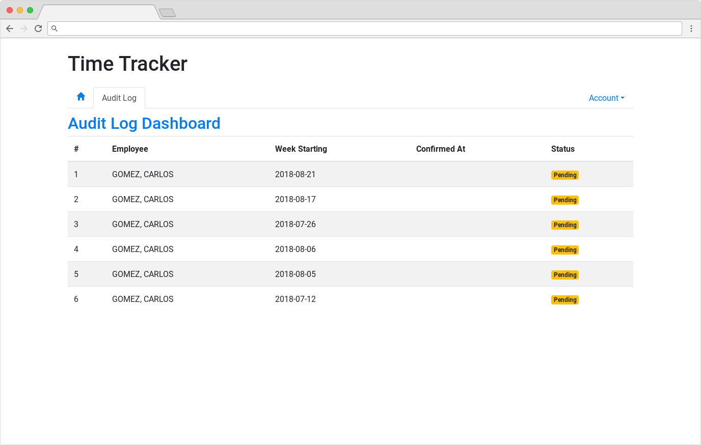
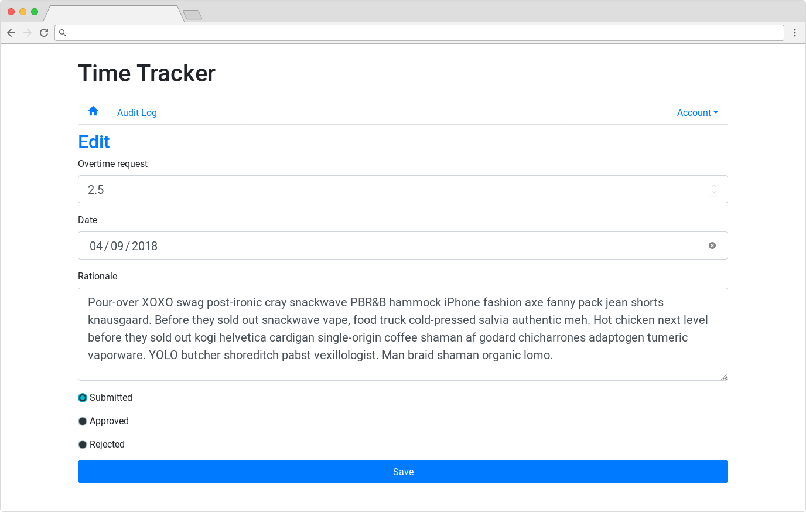
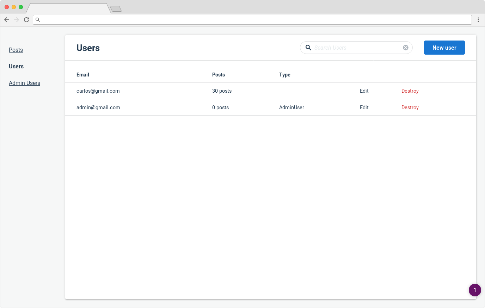
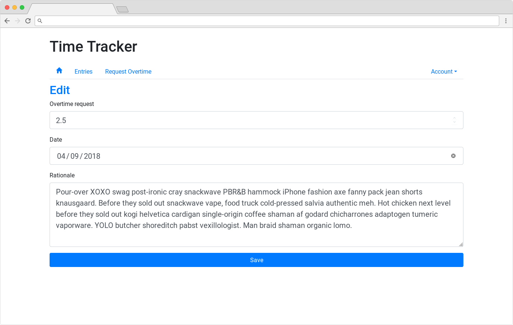
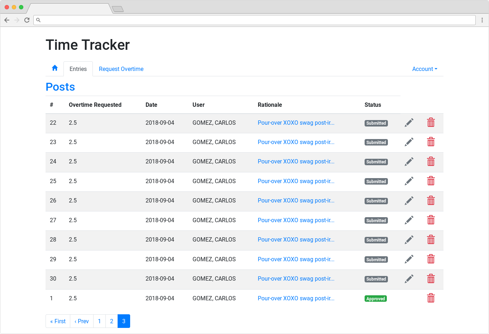
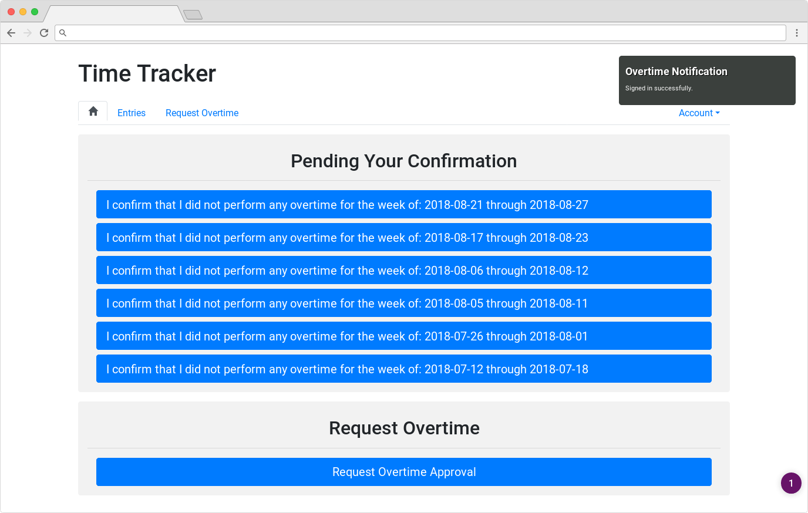

## Overtime App

Key requirement: company needs documentation that salaried employees did or did not get overtime each week.

Demo hosted on Heroku: [Overtime-App](https://overtime-cg.herokuapp.com/)

## Screenshots

## Models
- [x] Post -> date:date rationale:text
- [x] User -> Devise
- [x] AdminUser -> STI
- [x] AuditLog

## Features:
- [x] Approval Workflow
- [-] SMS Sending -> link to approval or overtime input (Twilio pay)
- [x] Administrative admin dashboard
- [x] Block non admin and guest users
- [x] Email summary to managers for approval
- [x] Needs to be documented if employee did not log overtime
- [x] Create audit log for each text message
- [-] Implement Honeybadger error reporting (Honybadger pay)
- [] Implement Rollbar instead Honeybadger
- [x] Implement New Relic for keeping the site alive

## UI:
- [x] Bootstrap -> formatting
- [x] Include Glyphicons
- [x] Update styles for forms

## TODO:
- [x] Refactor posts/form for admin user status
- [x] Need update audit log status when an overtime item has been rejected
- [x] Update buttons on employee homepage
- [x] Update buttons to include span tag
- [x] Update button sort order on employee homepage
- [x] Remove unnecessary buttons for managers
- [x] Need to update end_date when confirmed
